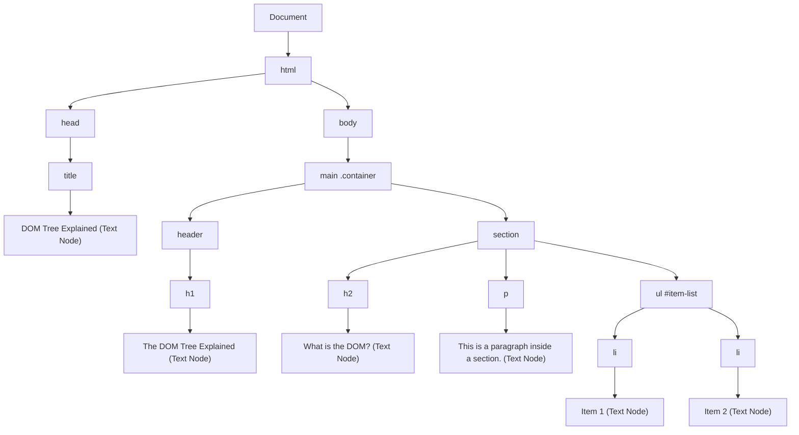

# Understanding the DOM Tree

The **Document Object Model (DOM)** is a programming interface for web documents. It represents the page so that programs can change the document structure, style, and content. The DOM represents the document as nodes and objects; that way, programming languages can interact with the page.

A web page is a document. This document can be either displayed in the browser window or as the HTML source. It is the same document in both cases.

## 🚫 Brand Guideline: Avoiding "Divitis"
A core philosophy of this project is to keep the DOM tree **simple and minimal** by avoiding the overuse of `<div>` tags (a common bad practice known as "divitis"). 

Instead of wrapping everything in a generic `<div>`, we use **Semantic HTML5 Elements** whenever possible to give meaning to the structure of the DOM tree:
- `<main>` instead of `<div id="main">`
- `<section>` and `<article>` for grouped content
- `<header>` and `<footer>` for page layout
- `<figure>` and `<figcaption>` for visual components
- `<menu>` or `<nav>` for controls and links

This keeps the DOM tree shallow, readable, and highly accessible!

## 📁 The Folder Analogy
Think of the DOM tree like the **folder structure** on your computer.

- **The `<html>` element** is like your main root folder (e.g., `C:\` drive or `Macintosh HD`).
- **The `<head>` and `<body>` elements** are two main folders inside that root directory.
- **Other semantic tags (like `<article>`, `<section>`, `<p>`)** are sub-folders or files nested inside those directories.
- **Attributes and text** are like the properties or the content inside a specific file.

Just like you can open folders, look inside them, move files around, or create new files, JavaScript allows you to do the exact same things with HTML elements!

## 💻 HTML Code to Diagram Mapping

Let's look at the simple semantic code we have in `index.html`:

```html
<!DOCTYPE html>
<html lang="en">
<head>
    <title>DOM Tree Explained</title>
</head>
<body>
    <main class="container">
        <header>
            <h1>The DOM Tree Explained</h1>
        </header>
        <section>
            <h2>What is the DOM?</h2>
            <p>This is a paragraph inside a section.</p>
            <ul id="item-list">
                <li>Item 1</li>
                <li>Item 2</li>
            </ul>
        </section>
    </main>
</body>
</html>
```

### 🌳 The Visual Diagram (Mermaid)

When the browser reads the HTML above, it creates a clean, semantic tree-like structure:



## ⚙️ How JavaScript interacts with it

Because it's a tree, we can use Javascript to "climb" the branches to find specific elements, create new ones, or delete existing ones.

Here's the code you can see in `index.js`, demonstrating this concept:

```javascript
// 1. SELECTING ELEMENTS (Finding Folders/Files)

// Finding a specific, uniquely named folder
const mainContainer = document.querySelector('.container');

// 2. TRAVERSING THE DOM (Navigating up and down folders)

// Going down: Finding children (files inside a folder)
const itemList = document.getElementById('item-list');
const listItems = itemList.children; // Gets all <li> elements inside the <ul>

// Going up: Finding a parent (the folder containing this file)
const firstListItem = listItems[0];
const parentList = firstListItem.parentElement; // Gets the <ul>

// 3. MANIPULATING THE DOM (Creating/Editing/Deleting files)

// Creating a new file and adding it (Using semantic tags, avoiding divs!)
const newItem = document.createElement('li');
newItem.textContent = 'Item 3 (Added via JS)';
itemList.appendChild(newItem); // Saving it into the folder
```
